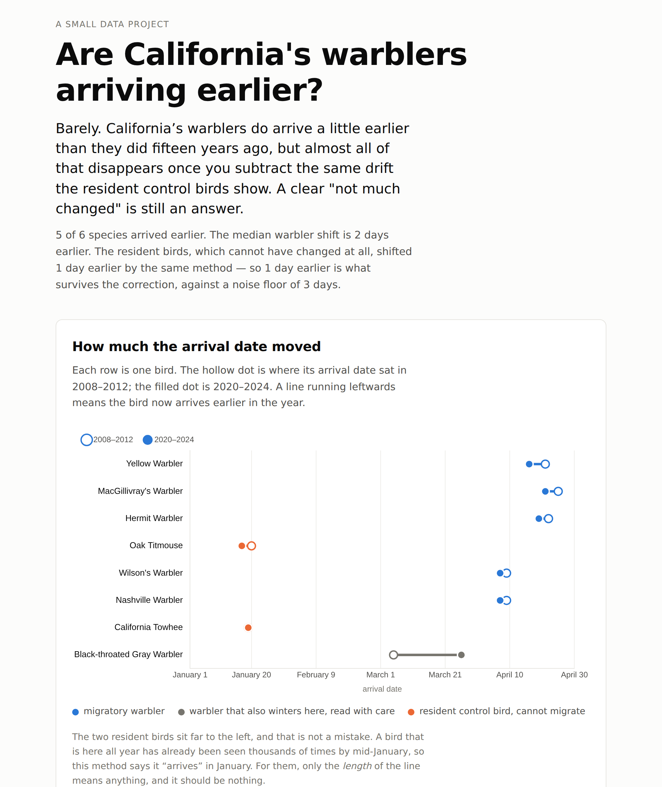

# Are California's warblers arriving earlier?

**Live site:** https://karishmadhingra30.github.io/warble_warble/

Fifteen years of birdwatcher records, asked one question: do migrating
warblers reach California earlier in spring than they used to?

---

## The question and the answer

**The question.** Eight species of warbler migrate into California every
spring. If springs are warming, they might be showing up sooner. Do the
records say they are?

**The answer.** Barely. Five of the six usable warblers do arrive earlier, by
two to five days, but the two resident birds that cannot possibly have
changed their arrival date shifted by a median of one day and by as much as
three, so almost all of the warbler movement is the measurement drifting
rather than the birds moving. **One day earlier survives the correction,
against a three-day noise floor: this method cannot show that California's
warblers have changed when they arrive.**

That is a real answer, not a failed one. The project was built to tell a few
days of bird behaviour apart from a decade of growth in birdwatching, and
what it found is that over this period, for these species, it cannot.



---

## The one methodological idea worth knowing

**We do not use the first sighting of spring, and you should be suspicious of
anyone who does.**

Far more people use eBird now than in 2010. The date of the first sighting is
really a measure of how many people were outside looking in early March: with
enough observers, somebody catches the leading edge of the migration on the
day it arrives. Compare 2010's first sighting to 2024's and you will find
"earlier arrival" that is mostly more binoculars.

**Instead: the 10th percentile day.** For each bird, in each spring, we take
the day by which one tenth of that year's sightings had happened.

> Picture the spring's sightings as a crowd filing through a door. The first
> person through is a fluke. The moment the first tenth are through is a
> property of the crowd. Double the number of people and the first person
> arrives sooner, but the one-tenth mark stays where it was.

Each five-year window (2008-2012 and 2020-2024) gets the median of its five
yearly dates. The shift is the late window minus the early window. Negative
means earlier.

A percentile is much steadier than a first sighting. It is **not immune**,
which is what the next section is about.

---

## The control birds

This is the part that makes the project worth trusting.

Two non-migratory species go through the identical method: **California
Towhee** and **Oak Titmouse**. Both hold the same few acres all year. Neither
can possibly arrive earlier, because neither arrives at all.

So whatever shift the method reports for them is not birds. It is the
measurement drifting, most likely because the people doing the birdwatching
changed. Whatever the warblers show, the controls' shift has to come off the
top before it means anything.

**What the control showed:** they moved, and they cannot have.

| | median shift |
|---|---|
| the six usable warblers | 2 days earlier |
| **the two resident controls** | **1 day earlier** |
| what survives the correction | 1 day earlier |

Oak Titmouse came out 3 days earlier and California Towhee did not move. An
Oak Titmouse in 2024 is sitting in the same oak its parents sat in; nothing
about its year changed. Those 3 days are pure measurement drift, and they are
the same size as the entire warbler signal.

So the page takes the largest apparent shift any resident showed and treats
it as the noise floor. One day of corrected warbler shift is inside it. The
control is the reason this project reports "not much changed" instead of
"warblers are arriving earlier", and the second headline would have been the
easy one to write.

## Every species

| species | kind | 2008-2012 | 2020-2024 | shift |
|---|---|---|---|---|
| Yellow Warbler | warbler | April 21 | April 16 | 5 days earlier |
| MacGillivray's Warbler | warbler | April 25 | April 21 | 4 days earlier |
| Orange-crowned Warbler | excluded | January 28 | January 24 | 4 days earlier |
| Hermit Warbler | warbler | April 22 | April 19 | 3 days earlier |
| Oak Titmouse | resident control | January 20 | January 17 | 3 days earlier |
| Wilson's Warbler | warbler | April 9 | April 7 | 2 days earlier |
| Nashville Warbler | warbler | April 9 | April 7 | 2 days earlier |
| Townsend's Warbler | excluded | January 8 | January 8 | no change |
| California Towhee | resident control | January 19 | January 19 | no change |
| Black-throated Gray Warbler | flagged | March 5 | March 26 | 21 days later |

**Two species were excluded by the data, not by me.** Townsend's Warbler has
**more** records in January (50,063) than in April (34,434), and
Orange-crowned Warbler is abundant here all winter. Neither has a spring
arrival left to measure. The pipeline counts all twelve months for every
species and applies a written threshold, so these two dropped out on their
own evidence. The counts are in [DECISIONS.md](DECISIONS.md).

**One species is flagged.** Black-throated Gray Warbler came back 21 days
*later*, alone against the field. Its five early-window springs were
18 February, 21 February, 5 March, 25 March and 29 March: a 40-day spread,
wider than the shift it supposedly shows. Its small winter population sits
exactly where the 10th percentile falls, so the number tips by weeks on a few
dozen records. It stays on the chart, greyed, with the reason attached. That
check was added after seeing the result, which is said plainly in
[DECISIONS.md](DECISIONS.md) section 9.

**The dates themselves look right**, which is a useful sanity check on the
whole pipeline: Wilson's Warbler in early April, Yellow and Hermit Warbler in
the third week, MacGillivray's last. That is the real order these birds
arrive in California.

---

## Architecture

```
  ┌─────────────────────────────────────────────────────────┐
  │  YOUR LAPTOP                     run by hand, now and    │
  │                                  then, never on a server │
  │   pipeline/species.py   name ──► GBIF taxonKey           │
  │   pipeline/fetch.py     ──────► api.gbif.org             │
  │                         ◄────── sightings (cached in     │
  │   pipeline/arrivals.py           data/raw/, gitignored)  │
  │        │  10th percentile, median, subtract              │
  │   pipeline/build.py                                      │
  └────────┼────────────────────────────────────────────────┘
           │ writes  ~20 KB
           ▼
  ┌─────────────────────────────────┐
  │  site/data/arrivals.json        │  committed to git
  └────────┬────────────────────────┘
           │ git push to main
           ▼
  ┌─────────────────────────────────────────────────────────┐
  │  GITHUB PAGES        .github/workflows/pages.yml         │
  │                      publishes site/ as-is              │
  │                                                          │
  │   index.html  +  styles.css  +  app.js  +  arrivals.json │
  │        │                                                 │
  │        └──► fetch('data/arrivals.json') ──► two charts   │
  └─────────────────────────────────────────────────────────┘
                              ▲
                              │  the browser NEVER calls GBIF
```

All the expensive work happens once, on a laptop, in Python. What ships to the
web is a few tens of kilobytes of finished numbers and three static files. The
page never calls GBIF, which is why the site is fast, free to host, and works
even when GBIF is down. It also means a visitor cannot accidentally generate
thousands of API requests by refreshing.

The pipeline is four modules, each with one job:

| file | job |
|---|---|
| `pipeline/species.py` | the bird list, the control flags, name → GBIF taxon key |
| `pipeline/fetch.py` | the only code that touches the network: paging, caching, rate limiting, retries |
| `pipeline/arrivals.py` | the arithmetic: day-of-year, the 10th percentile, medians, the shift |
| `pipeline/build.py` | the order the other three run in, and writing the JSON |

---

## Running it

You need Python 3.10 or newer.

```bash
git clone https://github.com/karishmadhingra30/warble_warble.git
cd warble_warble
python -m venv .venv && source .venv/bin/activate
pip install -r requirements.txt
```

### The pipeline

Work through it in stages the first time, so you catch a problem before
spending an hour on a download.

```bash
# 1. Check the taxon keys by hand before trusting them.
python pipeline/build.py --taxon-keys

# 2. Pull the monthly counts and see the shape of each bird's year.
#    This also rewrites the evidence table in DECISIONS.md.
python pipeline/build.py --monthly-report

# 3. The full run. Writes site/data/arrivals.json.
python pipeline/build.py
```

**Expect the first full run to take one to two hours.** It makes a few
thousand requests at one per second, which is the polite rate for a free
public API. Every response is cached in `data/raw/`, so the second run takes
seconds, and you can change the arithmetic and re-run as often as you like.
The cache is gitignored; delete it to force a fresh download.

### Previewing the site

```bash
cd site
python -m http.server 8000
```

Then open http://localhost:8000. A plain file open (`file://`) will not work,
because the page fetches its JSON and browsers block that on the file
protocol.

### The tests

```bash
pytest
```

They cover the parts that can be wrong without looking wrong: the percentile
arithmetic, the minimum-sightings rule, the sign of the shift, and the
day-of-year to calendar-date conversion including leap years.

### Publishing

Push to `main` and the workflow in `.github/workflows/pages.yml` publishes
`site/`. It does **not** run the pipeline: data is refreshed by running it
locally and committing the JSON.

**Turning Pages on:** the workflow does it for itself. `configure-pages` runs
with `enablement: true`, which switches the repository to building Pages from
GitHub Actions on the first run. If you would rather set it by hand, it is
repository **Settings** → **Pages** → **Source: GitHub Actions**.

---

## Data and citation

Everything comes from the
[EOD - eBird Observation Dataset](https://www.gbif.org/dataset/4fa7b334-ce0d-4e88-aaae-2e0c138d049e),
published by the Cornell Lab of Ornithology and accessed through the
[GBIF occurrence search API](https://techdocs.gbif.org/en/openapi/v1/occurrence).
Records are public domain (CC0); citation is asked for as good practice.

> GBIF.org. *GBIF Occurrence Search*. https://www.gbif.org/occurrence/search
>
> Cornell Lab of Ornithology. *EOD - eBird Observation Dataset*. Occurrence
> dataset https://doi.org/10.15468/aomfnb accessed via GBIF.org.
>
> eBird. *eBird: An online database of bird distribution and abundance* [web
> application]. eBird, Cornell Lab of Ornithology, Ithaca, New York.
> https://www.ebird.org

If you build on these numbers, GBIF asks you to register a
[derived dataset](https://www.gbif.org/citation-guidelines) so the exact
records get a DOI. Full detail, including every parameter and what was
verified how, is in **[DATA_SOURCES.md](DATA_SOURCES.md)**.

---

## Limits

Said plainly, because they matter more than the headline.

- **There are far more birdwatchers now.** The percentile and the control
  birds both push back on this. Neither is a complete fix. A shift smaller
  than the control's shift is noise.
- **Sightings are not a count of birds.** They are a count of times somebody
  wrote a bird down.
- **California is large.** A statewide number hides the coast behaving
  differently from the Central Valley and the Sierra.
- **Some of these birds spend the winter here.** A January record of a bird
  that never left is not an arrival. Species where this swamps the signal are
  dropped and named on the page; mild cases are flagged. The call is made
  from the monthly counts, not from memory.
- **Two windows is not a trend.** This compares one five-year block against
  another. It cannot say whether a change was steady, sudden, or ongoing.
- **Nothing here explains why.** Earlier arrival is consistent with warming
  springs. This project measures timing and offers no evidence about cause.

---

## Decisions

Every judgement call, with the reasoning and the evidence, is written down in
**[DECISIONS.md](DECISIONS.md)**: the California filter, the single-dataset
rule, the trimmed cache, the wintering-bird thresholds, the leap-year
correction, the minimum sightings, and the limits of the metric itself.
